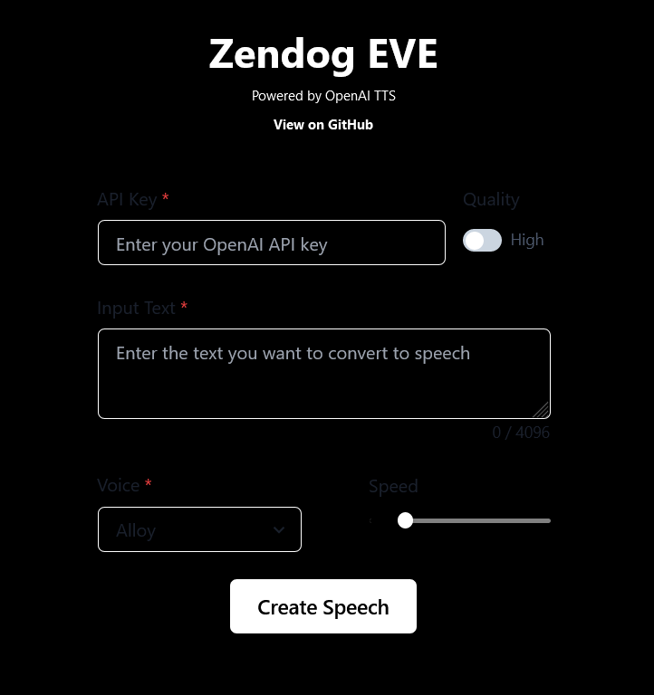

Check out the live website: [Zendog-eve](https://eve-red.vercel.app/)


# Zendog Eve.

Zendog Eve is a web app enabling users to convert text into natural-sounding speech. 

Powered by OpenAI's text-to-speech model, `tts-1`, the app has an intuitive user interface built with `Chakra UI`, providing a seamless experience for generating and downloading speech audio files:

 `.mp3`

Eve is an Electronic voice emulator.

## Features

* Convert text into speech using premium voices from OpenAI's cutting-edge TTS models.
*  Access a range of customizable voices to discover the perfect fit for your requirements.
*  Seamlessly adjust the speech speed to align with your preferred listening pace.
*  Maintain data privacy by providing your own API keys—no information is retained on the server.
*  Instantly download your converted speech as an MP3 file directly from your browser.
* Enjoy a user-friendly interface designed for optimal performance on various devices, ensuring a comfortable experience.

## Installation

Install the project locally,(vs-code,node.js) follow these steps:

1. Clone the repository to your local machine. `https://github.com/Mulc1b3R/eve.git`
2. Navigate to the project directory.         `cd C:/PATH/TO/FOLDER/`
3. Install dependencies with `npm install`.
4. Start the development server with `npm run dev`.
5. Open `http://localhost:3000` to view it in the browser. (firefox,brave,chrome).

## Usage

To utilize Zendog-Eve, follow these steps:

1. Input your OpenAI API key in the designated field.
2. Enter or paste the text you want to convert into the 'Input Text' section.
3. Customize the voice and adjust the speed to your preferences.
4. Tap 'Create Speech' to create the audio output.
5. Upon generating the audio, use the controls to play it back or select 'Download MP3' to save the file.

# Code.

Here is the original code that i used in the developement of Zendog-eve :
```
const fetch = require('node-fetch');
const fs = require('fs');
const path = require('path');

const api_key = "YOUR_API_KEY_HERE"                                          //api key

const baseURL = "https://api.openai.com/v1/audio/speech";                   // base url ( notice that "create" is not at the end of the path , the /create is added as part of the api request.

const speechFilePath = path.join(__dirname, './output/speech2.mp3');      //output file path.

async function main() {
    try {
        const response = await fetch(baseURL, {
            method: 'POST',
            headers: {
                'Content-Type': 'application/json',
                'Authorization': `Bearer ${api_key}`,
                'Accept-Encoding': 'identity'
            },
            body: JSON.stringify({
                model: "tts-1",                                                       // the open ai model used.
                voice: "fable",                                                 // the open ai voice selected. (fable is an English accent that sounds a bit like Harry Potter).
                prompt: "Turn text into audio mp3 file.",
                input: "This is the input text for speech generation."           // this is the text input field , the text in this field is transformed into an mp3.
            })                                                                   // A txt input area is required by the UI for the user to input txt by typing or pasting.   
        });

        const buffer = await response.buffer();
        fs.writeFileSync(speechFilePath, buffer);

        console.log('Speech file saved successfully. Your mp3 is in the output folder. Have a great day!');
    } catch (error) {
        console.error('Error:', error);
    }
}

main();
```


## Voices.

As the documentation lacks specific descriptions for each voice, I consulted ChatGPT, via <a href="https://zendog.vercel.app/">Zendog-UI</a>, to provide informed assessments based on their speech:

- Alloy: A versatile voice potentially appropriate for technical or instructional content like tutorials, educational material, or any material necessitating clarity and precision.

- Echo: Suited for storytelling, audiobooks, or content requiring a dramatic or narrative tone.

- Fable: Well-suited for children's stories, fantasy content, or any narrative demanding a playful or imaginative flair.

- Onyx: Recommended for reading serious literature, delivering news content, or any material needing a serious or formal delivery.

- Nova: Ideal for advertisements, motivational content, or materials requiring a positive and enthusiastic tone.

- Shimmer: Appropriate for lifestyle content, podcasts, or any content necessitating an engaging, friendly, and welcoming delivery.
  

## Contributing

Contributions are welcome! If you have a suggestion or an issue, please use the [issues](#) page to let me know.

## License.

This project is licensed under the Apache 2.0 License.

## Acknowledgments

- Thanks to OpenAI for providing the text-to-speech API.
- Chakra UI for the beautiful component library.
- <a target="_blank" href="https://icons8.com/icon/PgPOu9C2G4Dq/speech-to-text">Speech To Text</a> icon by <a target="_blank" href="https://icons8.com">Icons8</a>
- Credits:mojo, zen, mulciber, Justmalhar.

## Deploy on Vercel

The easiest way to deploy your Next.js app is to use the [Vercel Platform](https://vercel.com/new?utm_medium=default-template&filter=next.js&utm_source=create-next-app&utm_campaign=create-next-app-readme) from the creators of Next.js.

Check out our [Next.js deployment documentation](https://nextjs.org/docs/deployment) for more details.
